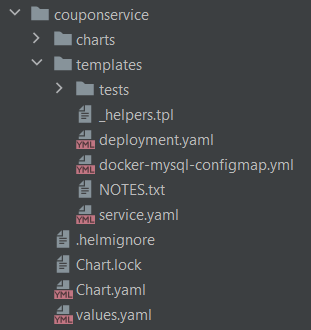

## Basic Commands

### Checking the current repository
```bash
helm repo list
```

### Adding a Repository

```bash
helm repo add bitnami https://charts.bitnami.com/bitnami
```

### Listing all repo

```bash
helm repo list
```

### Removing a Repo

```bash
helm repo remove bitnami
```

### Search the repository

~~~bash
helm search repo mysql
helm search repo database
helm search repo database --versions
~~~


### Install a package

~~~
kubectl get pods

(Below Two commands - In a Different Shell/Commandline window/tab)

minikube ssh

docker images

helm install mydb bitnami/mysql

(The above will install mysql in default namespace)

~~~

### Pass values from values.yaml file.

~~~bash
helm install mydb bitnami/mysql --values /home/ambrish/helm/values.yaml
~~~

### Check the cluster

~~~
kubectl get pods

minikube ssh

docker images
~~~

### To check the installation status
~~~bash
helm status mydb
~~~

### To Upgrade

~~~
ROOT_PASSWORD=$(kubectl get secret --namespace default mydb-mysql -o jsonpath="{.data.mysql-root-password}" | base64 --decode)

helm upgrade --namespace default mysql-release bitnami/mysql --set auth.rootPassword=$ROOT_PASSWORD

OR 

helm upgrade --namespace default mysql-release bitnami/mysql --values /home/ambrish/helm/values.yaml
~~~

### values.yaml file
~~~
auth:
  rootPassword:123456
~~~

You can also merge install and upgrade command into one. It will upgrade if installation exists otherwise install.

~~~bash
helm upgrade --install --namespace default mysql-release bitnami/mysql --set auth.rootPassword=$ROOT_PASSWORD
~~~

### To Uninstall 

~~~bash
helm uninstall mysql-release
~~~

### To Install a Package in different Namespace

~~~bash
kubectl create ns teamtwo

helm install -n teamtwo mydb bitnami/mysql

OR

helm install --namespace teamtwo mydb bitnami/mysql
~~~

You can skip the kubectl command above and directly use the ``--create-namespace`` flag given by Helm.

~~~bash
helm install mydb bitnami/mysql -n teamtwo --create-namespace

OR

helm install mydb bitnami/mysql -namespace teamtwo --create-namespace
~~~

### List and Uninstall within a Namespace

Always use uninstall command with --keep-history flag so that you can later revert your changes.
~~~bash
helm list --namespace teamtwo

helm uninstall mydb -n teamtwo --keep-history
~~~

## Advanced Commands

### Helm Workflow when you run

~~~bash
helm install mydb bitnami/mysql
~~~

It performs these activities
~~~
1. Load the chart and its dependencies. This inclues values.yaml, templates directory etc.
2. Parse the values.yaml file and replace the corresponding placeholders in files inside templates directory.
3. Parse the generated YAML to k8s objects (deployment, service, ingress etc).
4. Validates the YAML and k8s Objects.
5. Send the objects to k8s
~~~

### dry-run helm install

The ``--dry-run`` flag is used with the helm install or helm upgrade commands. When you run ``helm install --dry-run`` 
or ``helm upgrade --dry-run``, Helm simulates the installation or upgrade process without actually making any changes 
to the Kubernetes cluster. It performs all the actions as if it were a real installation or upgrade, including 
rendering the templates, substituting values, and validating the resources. However, it stops short of actually 
creating or modifying any resources in the cluster.

The purpose of the --dry-run flag is to provide a way to test the installation or upgrade process and see the 
resulting manifest files without affecting the running cluster. It allows you to catch any potential issues or 
misconfigurations before applying the changes. This is particularly useful in situations where you want to validate the
deployment process or ensure the generated manifests are correct before proceeding with the actual deployment.

This will perform all steps in workflows except the last one which is - ``Send the objects to k8s``.
This command also ``requires an active k8s cluster to validate objects`` and 
that is where it is different from ``helm template`` command.
~~~bash
helm install mydb bitnami/mysql -values /home/ambrish/path/to/values.yaml --dry-run
~~~
The above command will print STATUS along with all the templates on the console.
Here status will be - ``pending-install``

This commands gives you what all are you going to create on k8s cluster.

Basically, dry-run displays 3 types of information on console:

~~~
1. Release information
2. k8s templates
3. Release notes if you have given any
~~~

~~~bash
helm upgrade mydb bitnami/mysql -values /home/ambrish/path/to/values.yaml --dry-run
~~~
This will only show the changes done in this upgrade.

### helm template

The helm template command in Helm is used to render Kubernetes manifest files based on a Helm chart. It processes the 
chart and its templates, substituting the values and generating the resulting manifest files without installing or 
upgrading any resources in the Kubernetes cluster.

When you run helm template, Helm renders the templates within the chart, replaces the placeholders with the specified 
values or default values, and generates the resulting YAML files. These files can then be inspected or further 
processed outside of Helm. This command is useful for previewing the rendered manifest files before deploying them to a 
Kubernetes cluster. It allows you to verify that the generated manifests are correct and meet your expectations.
The helm template command does not display resource status or release information or release notes. 

The helm template command operates solely on the Helm chart and its templates. It ``doesn't require a live Kubernetes 
cluster because it doesn't interact with the cluster during its execution``. Instead, it relies on the local files and 
the provided input values to render the templates and generate the resulting manifest files.

~~~bash
helm template mydb bitnami/mysql -values=/home/ambrish/path/to/values.yaml
~~~

### helm get command

The helm get command is used in Helm to retrieve information about a deployed release in a Kubernetes cluster. It 
allows you to fetch various details and status information related to a specific release.

The helm get command supports several subcommands that provide different types of information:

helm get all [RELEASE_NAME] retrieves all available information about a release, including the release status, 
chart version, chart name, namespace, and timestamps for the deployment, upgrade, and deletion.

helm get manifest [RELEASE_NAME] displays the manifest files generated for the release. It shows the rendered YAML 
files that define the resources deployed as part of the release.

helm get values [RELEASE_NAME] shows the values used during the release installation or upgrade. It displays the values
specified in the values.yaml file of the chart or any custom values provided during installation or upgrade.

helm get notes [RELEASE_NAME] retrieves the release notes associated with the chart. These notes are usually specified 
in a NOTES.txt file within the chart, and they provide additional information, instructions, or guidance related to 
the release.

helm get hooks [RELEASE_NAME] displays any pre-install, post-install, pre-upgrade, or post-upgrade hooks defined in the 
chart. Hooks are scripts or commands that can be executed during various stages of the release process.

The [RELEASE_NAME] parameter is optional. If not provided, the helm get command will retrieve information about the 
last deployed release in the current namespace.

The helm get command is useful for inspecting the details, status, and configuration of a release in your Kubernetes 
cluster. It helps you troubleshoot issues, review deployment information, and access relevant data associated with a 
specific Helm release.

~~~bash
helm get notes mydb
helm get values mydb
helm get manifest mydb
helm get manifest mydb --revision 1
helm get values mydb --revision 1
~~~

### helm history command

The ``helm history`` command is used in Helm to view the revision history of a specific release. It provides a list of 
all the revisions made to a release, including information such as revision number, status, and timestamp. It allows 
you to track the changes made to a release over time.

The basic syntax of the helm history command is as follows:
~~~bash
helm history RELEASE_NAME
~~~
Here are some examples of using the helm history command, assuming the release name is mydb:

~~~bash
helm history mydb
~~~
This command will display a list of revisions for the mydb release, including revision number, status, and timestamp.

Get detailed information for a specific revision of the mydb release:
~~~bash
helm history mydb --revision REVISION_NUMBER
~~~
Replace REVISION_NUMBER with the specific revision number you want to inspect. This command will provide detailed 
information about the specified revision, including the release manifest, values used, 
and any associated release notes.

### helm rollback command

The ``helm rollback`` command in Helm is used to revert a release to a previous revision. It allows you to undo changes 
made in a specific revision and restore the deployment to a previous state.

The basic syntax of the helm rollback command is as follows:
~~~bash
helm rollback RELEASE_NAME REVISION_NUMBER
~~~

Here's an example of using the helm rollback command to roll back the release mydb to revision 2:

~~~bash
helm rollback mydb 2
~~~

When you execute the ``helm rollback`` command, Helm performs the following steps:

1. It identifies the specified release (RELEASE_NAME) and locates the target revision (REVISION_NUMBER).
2. Helm initiates a rollback by reverting the release to the specified revision.
3. It updates the release status and records the rollback in the release history.

During the rollback process, Helm takes care of updating the Kubernetes cluster with the resources defined in the 
rolled-back revision. It restores the previous state of the deployment by applying the manifest files associated with 
the specified revision.

It's important to note that rolling back a release only affects the resources associated with that release. It does not 
undo changes made to the underlying Kubernetes cluster or affect other unrelated deployments.

### Wait and Timeout option
In Helm, the --wait and --timeout flags are used with the helm install command to control the deployment process and 
wait for the resources to become ready within a specified time period.

--wait: The --wait flag instructs Helm to wait until all deployed resources are in a ready state before completing the 
installation process. By default, when you run helm install, Helm initiates the installation and immediately returns, 
without waiting for the resources to be fully deployed and ready. However, if you include the --wait flag, Helm will 
monitor the deployment progress and wait until all resources reach a ready state.

--timeout: The --timeout flag allows you to specify the maximum amount of time in seconds that Helm should wait for the 
resources to become ready. If the deployment process exceeds the specified timeout duration, Helm will abort and return 
an error. This flag is useful in situations where you want to set a specific time limit for the deployment process and 
prevent it from running indefinitely.

Here's an example of using both flags with the helm install command:

~~~bash
helm install --wait --timeout 10m40s mychart
~~~

In this example, the --wait flag ensures that Helm waits for all deployed resources to be ready. The --timeout 300 flag 
sets a timeout of 10 minutes and 40 seconds, meaning Helm will abort the installation process if the resources don't 
become ready within that timeframe.

### Atomic Install

By default, Helm installs resources in a release incrementally. This means that if any resource fails to install during 
the installation process, Helm will continue to install the remaining resources. This behavior may result in an 
inconsistent or partially deployed release.

However, when the ``--atomic`` flag is used, Helm enforces atomicity during the installation process. If any error or 
failure occurs during the installation of any resource in the release, Helm will roll back and uninstall all resources 
associated with that release. This ensures that the cluster remains in a consistent state.

The --atomic flag is particularly useful when you have multiple resources that depend on each other or require a 
consistent deployment state. It helps maintain data integrity and prevents partial or incomplete deployments.

Here's an example of using the --atomic flag with the helm install command:
~~~bash
helm install --atomic mychart
~~~
In this example, the --atomic flag is included to enforce atomic installation. If any error occurs during the 
installation of resources in the mychart release, Helm will undo the installation and remove all the resources 
associated with that release.

It's important to note that atomic installation requires Helm to have the necessary permissions to install and 
uninstall resources. If Helm lacks the required permissions, the atomic installation may fail, and the rollback may not 
be executed successfully.

### Helm Lint command

The ``helm lint`` command is used in Helm to perform static analysis and validation of a Helm chart. It examines the 
chart's structure, files, and configurations to check for potential issues, errors, or best practices violations. 
The primary purpose of the helm lint command is to ensure that the chart is well-formed and follows the recommended 
guidelines before packaging and deploying it.


--------------------------------------------------------------------------------------

## Helm Template Objects

In any YAML file, you can provide dynamic values for various placeholders using these objects:

1. .Values  - This will point to properties define in values.yaml file, if any present.
2. .Chart   - This will point to properties define in Chart.yaml file.
3. .Release - This will provide release information.
4. .Template - This will provide current template information.

## Create Chart

~~~bash
helm create couponservice
~~~

This will create a chart with following directory structure. After removing few auto generated
files and adding docker-mysql-configmap.yml.



Now if you have define any dependency in Chart.yaml file, then you need to run

~~~bash
helm dependency update
~~~

After that run below command from chart directory to install Chart

~~~bash
helm install couponservice .
~~~

Check the PODs and SERVICES using:

~~~bash
kubectl get pods
kubectl get svc
~~~ 


